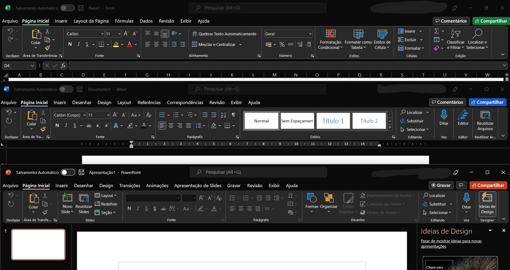
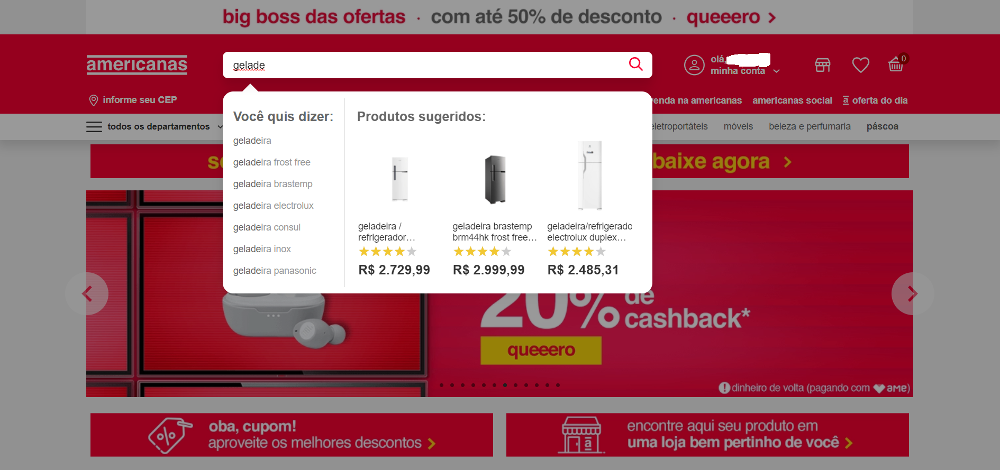
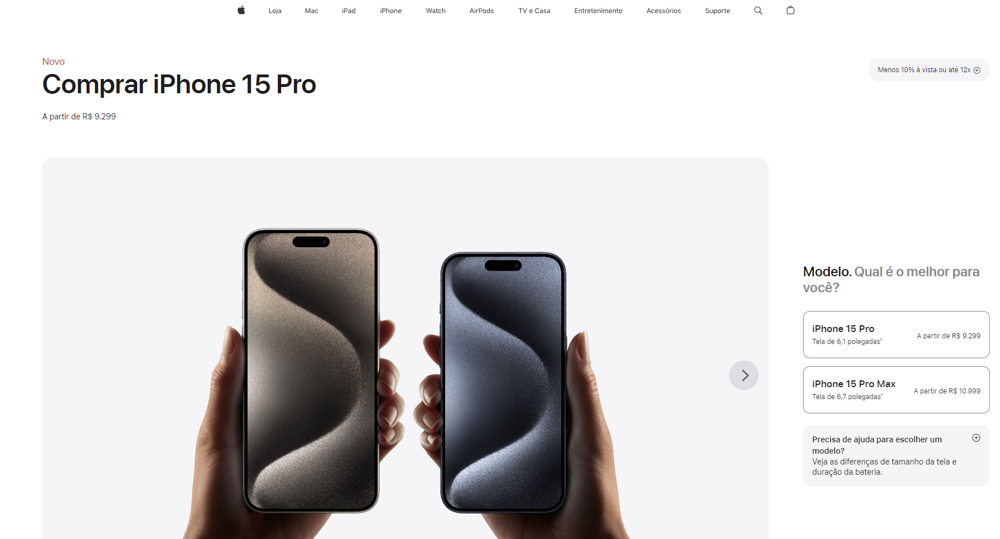
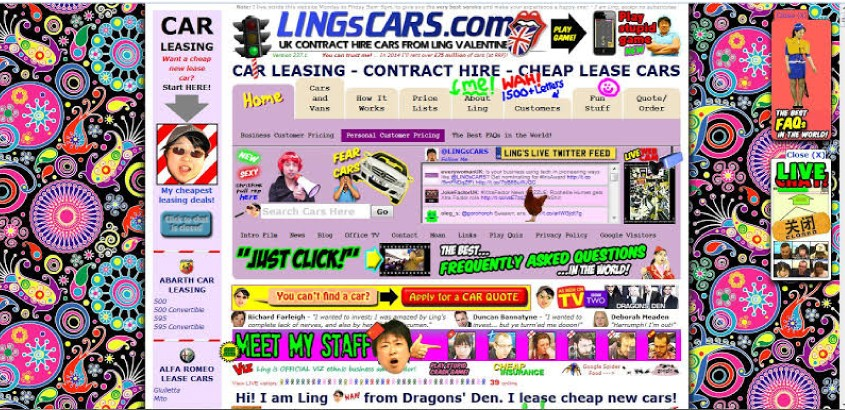

Heurísticas

1. Consistência e padrões: Os usuários não deveriam se perguntar se palavras, situações ou ações diferentes significam a mesma coisa. Siga as convenções da plataforma e do setor.

   

- Os programas da Microsoft, por exemplo, seguem padrões, sendo que os itens do menu ficam sempre na parte superior, os ícones que realizam a mesma ação são repetidos em todas as interfaces, como os da seção Clipboard, em que a tipografia é a mesma e mantém o mesmo tamanho e cor.

2. Prevenção de erros: Boas mensagens de erro são importantes, mas os melhores designs evitam cuidadosamente a ocorrência de problemas. Elimine condições propensas a erros ou verifique-as e apresente aos usuários uma opção de confirmação antes de se comprometerem com a ação.

   

 
 - Ao digitar uma caixa com varias opções ao usuário, evitando que digite errado e faça uma pesquisa que não localiza o produto.

3.Reconhecimento em vez de lembrança
Minimize a carga de memória do usuário tornando visíveis elementos, ações e opções. O usuário não deveria ter que lembrar informações de uma parte da interface para outra. As informações necessárias para usar o design (por exemplo, rótulos de campos ou itens de menu) devem estar visíveis ou facilmente recuperáveis ​​quando necessário.

   

   

- Os sites de e-commerce, por exemplo, costumam seguir padrões em seu layout, tendo a barra de busca no topo, o carrinho no canto superior direito, na página do produto fica uma foto deste a esquerda e sua descrição na direita, permitindo assim que o usuário reconheça o layout de experiências anteriores que ele teve nos demais sites do gênero, focando mais sua atenção nos produtos, do que em aprender a utilizar o site.

4.Design estético e minimalista:
As interfaces não devem conter informações irrelevantes ou raramente necessárias. Cada unidade extra de informação numa interface compete com as unidades de informação relevantes e diminui a sua visibilidade relativa.

   

-O site da Apple é um bom exemplo de estética e design minimalista, ele é bem simples e objetivo, mostrando o nome do produto, uma linha o descrevendo e a foto dele grande e destacada com cores contrastantes, além disso o site valoriza o espaço em branco, os elementos são bem organizados e a tipografia usada é simples e limpa.

   

- Site com muita informação e pouco objetivo.

5.Ajude os usuários a reconhecer, diagnosticar e se recuperar de erros:
As mensagens de erro devem ser expressas em linguagem simples (sem códigos de erro), indicar com precisão o problema e sugerir uma solução de forma construtiva.

   

- Por exemplo, o formulário de criação de conta da Amazon mostra quando um dado está preenchido incorretamente, no momento de preencher os dados a plataforma orienta onde está o erro, próximo do campo em que ele ocorreu e os passos para corrigi-lo.